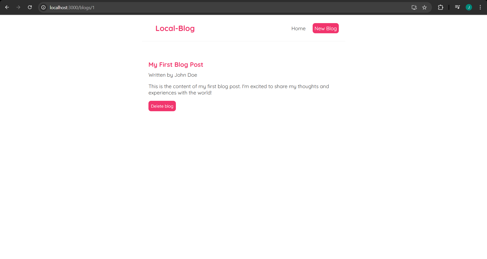
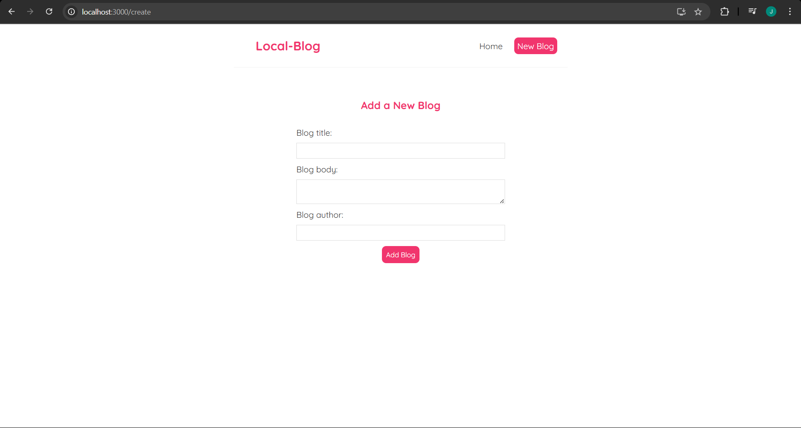

# 📝 Local-Blog

A modern, minimal React-based blog website where users can read and add blogs. This project was built for learning, portfolio, and practical frontend development experience.

---

## 🚀 Features

- 📰 View a list of blogs
- 🔍 View blog details
- ✍️ Add new blog posts and also delete blog
- ⚡ React Router for navigation
- 🎯 Fully responsive UI

---

## 📸 Screenshots

### 🏠 Homepage


### 📄 Blog Detail


### 📄 Blog Detail


---

## 🛠️ Tech Stack

- ⚛️ **React JS**
- 🧭 **React Router**
- 💻 **LocalStorage** or JSON for temporary data

---

## 🧑‍💻 Getting Started

```bash
# Clone the repository
git clone https://github.com/your-username/react-blog.git

# Navigate into the folder
cd local-blog

# Install dependencies
npm install

# Start the development server
npm start

# for data
1. add new terminal on VS code 
2. run : npx json-server --watch data/db.json --port 8000

🙋‍♂️ Author
Made with ❤️ by Jay